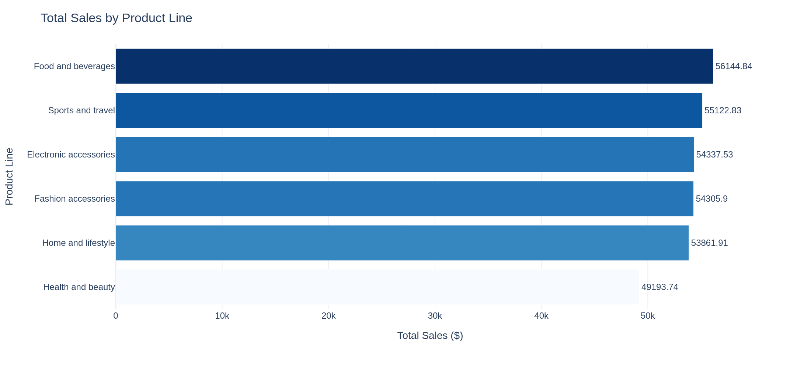
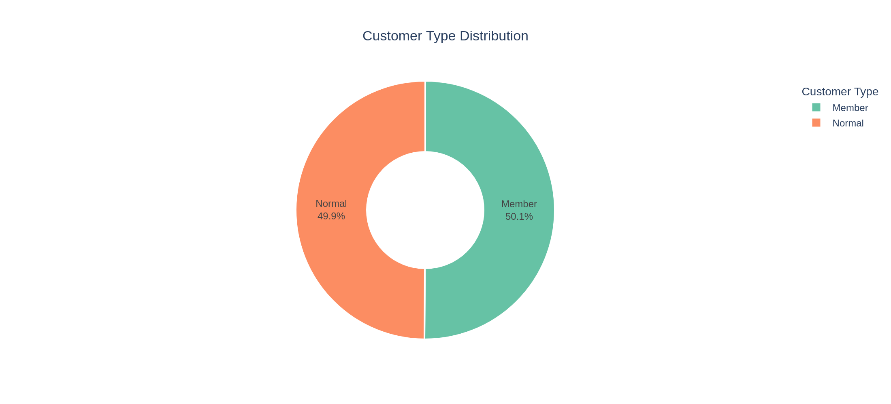
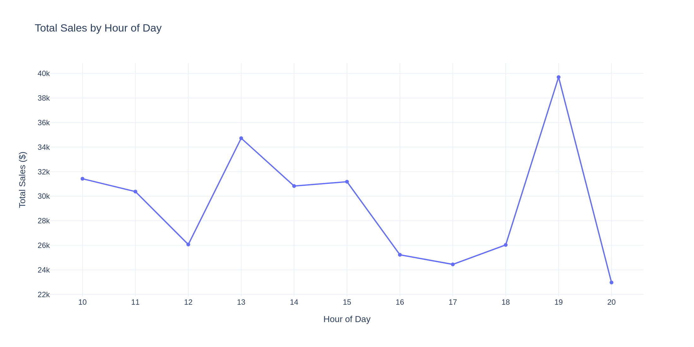
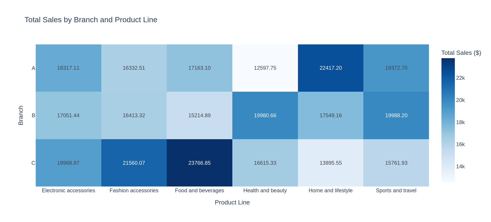
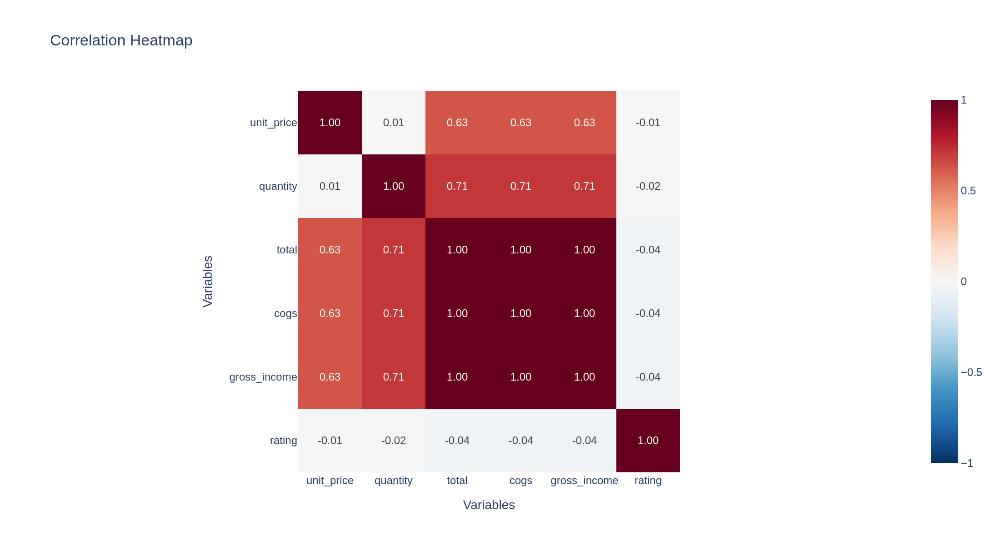

# Supermarket Sales Analysis

An end-to-end exploratory and statistical analysis of 1,000 supermarket invoices from three branches (Q1 2019), built in Python with pandas, Plotly and SciPy.


---

## Table of contents

1. [Project overview](#1-project-overview)
2. [Key findings](#2-key-findings)
3. [Charts](#3-charts)
4. [The dataset in brief](#4-the-dataset-in-brief)
5. [The notebook in brief](#5-the-notebook-in-brief)
6. [Final conclusion](#6-final-conclusion)
7. [Limitations](#7-limitations)
8. [Repository structure](#8-repository-structure)
9. [How to run](#9-how-to-run)
10. [Documentation index](#10-documentation-index)
11. [Author](#11-author)

---

## 1. Project overview

**Business questions**

- Is the data clean and reliable?
- How do sales differ by branch, product line, customer type, gender, hour of day and payment method?
- Are any of those differences, or any relationships between variables, statistically meaningful?

**Approach.** Data validation → cleaning and feature extraction → grouped analysis → visualisation → hypothesis testing (correlation, normality, t-test, Mann-Whitney U, chi-square) → outlier detection.

**Scope note.** The dataset is invoice-level, covers 89 days, and shows strong signs of being synthetic, so this project demonstrates an analytical workflow rather than measuring a real business. See [Limitations](#7-limitations).

---

## 2. Key findings

| Area | Finding |
|---|---|
| **Overall** | 1,000 invoices, total sales **322,966.75**, average invoice **322.97** |
| **Branches** | Branch C has the highest sales (110,568.71 vs 106,200.37 for A and 106,197.67 for B) despite having the fewest orders (328), because its average invoice is highest (337.10) |
| **Product lines** | Evenly balanced: Food and beverages leads (17.4% of sales), Health and beauty is lowest (15.2%); the top-to-bottom gap is 14.1% |
| **Customers** | 50.1% Member / 49.9% Normal invoices; members spend slightly more per invoice (327.79 vs 318.12) but the difference is **not significant** (p = 0.53 / 0.59) |
| **Timing** | Sales peak at **19:00** (39,699.51; 113 orders), with a secondary peak at 13:00; weakest hours are 16:00–17:00 and 20:00 |
| **Weekend vs weekday** | Weekend average invoice is higher (338.65 vs 316.34) but **not significant** (p = 0.19 / 0.11) |
| **Payment** | Evenly split (Cash 344, Ewallet 345, Credit card 311 invoices); payment method is independent of branch (p = 0.51) |
| **Associations** | Customer rating is unrelated to spending (r = −0.036, p = 0.25); no significant association between branch, gender, product line and customer type |
| **Outliers** | 9 unusually large invoices (0.90%); no special treatment needed |

---

## 3. Charts

Five charts exported from the notebook. Full explanations are in the [charts documentation](charts/README.md).

<table>
  <tr>
    <td width="50%"><a href="charts/01_total_sales_by_product_line.png"></a><br><b>1. Total Sales by Product Line</b><br>Sales are spread evenly; Health and beauty trails.</td>
    <td width="50%"><a href="charts/02_customer_type_distribution.png"></a><br><b>2. Customer Type Distribution</b><br>A near-perfect 50/50 split of Members and Normal customers.</td>
  </tr>
  <tr>
    <td width="50%"><a href="charts/03_total_sales_by_hour.png"></a><br><b>3. Total Sales by Hour of Day</b><br>Peak at 19:00, secondary peak at 13:00.</td>
    <td width="50%"><a href="charts/04_sales_heatmap_branch_product.png"></a><br><b>4. Sales by Branch and Product Line</b><br>No branch dominates across all product lines.</td>
  </tr>
  <tr>
    <td colspan="2"><a href="charts/05_correlation_heatmap.png"></a><br><b>5. Correlation Heatmap</b><br>Strong correlations are arithmetic; rating is unrelated to everything else.</td>
  </tr>
</table>

---

## 4. The dataset in brief

| | |
|---|---|
| **File** | [`supermarket_sales - Sheet1.csv`](supermarket_sales%20-%20Sheet1.csv) |
| **Size** | 1,000 rows × 17 columns |
| **Period** | 1 Jan – 30 Mar 2019 (89 days) |
| **Grain** | One row = one invoice |
| **Locations** | Branch A (Yangon), B (Mandalay), C (Naypyitaw) |
| **Dimensions** | Customer type, gender, product line (6), payment method (3) |
| **Measures** | Unit price, quantity, tax, total, cogs, gross income, rating |
| **Quality** | No missing values, no duplicates, unique invoice IDs |

Important characteristics: `total = cogs × 1.05`, `gross income` equals the 5% tax (so it is **not** profit), `gross margin percentage` is constant, and no currency or customer ID is provided.

**Full documentation:** [docs/DATASET_README.md](docs/DATASET_README.md) covers the data dictionary, distributions, built-in relationships, data quality checks and limitations.

---

## 5. The notebook in brief

**File:** [`Supermarket_Ədalət_Sadıqov.ipynb`](Supermarket_%C6%8Fdal%C9%99t_Sad%C4%B1qov.ipynb)

**Workflow:** load → explore → check quality → clean and engineer features (`hour`, `month`, `dayofweek`, `weekend`) → group analysis → visuals → gross margin analysis → statistical tests → payment analysis.

**Libraries**

| Library | Role |
|---|---|
| pandas | Loading, cleaning, aggregation, cross-tabulation |
| Plotly Express | Interactive charts |
| SciPy (`stats`) | Hypothesis tests |
| NumPy | Imported; used internally by pandas and SciPy |

**Statistical methods**

| Method | Purpose |
|---|---|
| Pearson correlation | Linear relationship between numeric variables |
| Shapiro-Wilk | Check normality (decides which tests to trust) |
| t-test and Mann-Whitney U | Compare spending between two groups (Member vs Normal, weekend vs weekday) |
| Chi-square test of independence | Association between categorical variables |
| IQR rule | Detect outlier invoices |

**Full documentation:** [docs/NOTEBOOK_README.md](docs/NOTEBOOK_README.md) explains each section, library and test, the reason for choosing it, and the results.

---

## 6. Final conclusion

**The data is clean, and the business it describes is remarkably homogeneous.** Across branches, product lines, customer types, payment methods and weekend/weekday, the differences in sales and average invoice are small, and none of the statistical tests found a significant difference or association.

**What the analysis supports**

- Sales are balanced across product lines and payment methods, and every branch performs at a similar level. Branch C's 4% lead comes from a higher average invoice, not more orders.
- The **evening hour (19:00)** is the strongest sales hour, followed by 13:00; 16:00–17:00 and 20:00 are the weakest.
- Membership, weekend shopping and customer rating show **no statistically significant effect** on spending.
- Correlations between price, quantity and total are arithmetic consequences of how the columns are built, not behavioural findings.

**What it does not support**

- No evidence for a different strategy by branch, product line or customer segment.
- The 19:00 peak is a **hypothesis for staffing or promotion timing**, because the notebook does not test it statistically.
- "Not significant" means *no evidence of a difference*, not *proof of no difference*: with a few hundred invoices per group, small effects (roughly under 13% of the average invoice) would not be detected.
- No conclusion about profitability, since `gross income` is only the 5% tax.

**Suggested next steps**

1. Test spending by gender and by branch, and analyse month and day of week (already derived in the notebook).
2. Test the 19:00 peak against the other hours.
3. Add effect sizes and confidence intervals to every comparison.
4. Repeat the workflow on a real dataset with customer IDs, real cost data and at least 12 months of history.

---

## 7. Limitations

- **Invoice-level data, no customer ID:** no retention, repeat-purchase or lifetime-value analysis; "Member share" refers to invoices.
- **`gross income` is tax, not profit:** profitability cannot be assessed.
- **Currency is not stated:** charts use `$` as an assumption.
- **`Branch` and `City` are the same information** (1:1), so branch and city effects cannot be separated.
- **Short period (89 days, one season):** no year-over-year comparison or seasonality analysis.
- **Data looks synthetic:** unit price, quantity and rating are spread almost uniformly, and nearly every segment comparison is indistinguishable. Treat the results as a demonstration of method.
- **Observational data:** associations are not causal effects.
- **Multiple tests without correction:** none was significant, so conclusions are unaffected, but this matters if the analysis is extended.

---

## 8. Repository structure

```
supermarket-sales-analysis/
├── README.md                                 ← this file
├── Supermarket_Ədalət_Sadıqov.ipynb          ← analysis notebook
├── supermarket_sales - Sheet1.csv            ← dataset
├── requirements.txt
├── .gitignore
├── charts/
│   ├── README.md                             ← chart explanations
│   ├── 01_total_sales_by_product_line.png
│   ├── 02_customer_type_distribution.png
│   ├── 03_total_sales_by_hour.png
│   ├── 04_sales_heatmap_branch_product.png
│   └── 05_correlation_heatmap.png
└── docs/
    ├── DATASET_README.md                     ← dataset documentation
    └── NOTEBOOK_README.md                    ← notebook guide
```

---

## 9. How to run

```bash
# 1. Clone the repository
git clone https://github.com/edaletsadigov/supermarket-sales-analysis.git
cd supermarket-sales-analysis

# 2. (Optional) create a virtual environment
python -m venv venv
venv\Scripts\activate          # Windows
# source venv/bin/activate     # macOS / Linux

# 3. Install dependencies
pip install -r requirements.txt

# 4. Open the notebook
jupyter notebook Supermarket_Ədalət_Sadıqov.ipynb
```

Requirements: Python 3.12 or newer. Keep the CSV in the same folder as the notebook, then use **Kernel → Restart & Run All**.

---

## 10. Documentation index

| Document | Contents |
|---|---|
| [charts/README.md](charts/README.md) | The five charts: what each shows, how to read it, key numbers and caveats |
| [docs/DATASET_README.md](docs/DATASET_README.md) | Data dictionary, distributions, built-in relationships, quality checks, limitations |
| [docs/NOTEBOOK_README.md](docs/NOTEBOOK_README.md) | Notebook structure, libraries, statistical methods and why they were used |

---

## 11. Author

**Ədalət Sadıqov**, Data Analyst
GitHub: [edaletsadigov](https://github.com/edaletsadigov) · LinkedIn: [edaletsadigov](https://www.linkedin.com/in/edaletsadigov)

*Dataset: publicly available "Supermarket sales" data. Check the original source license before redistributing.*
