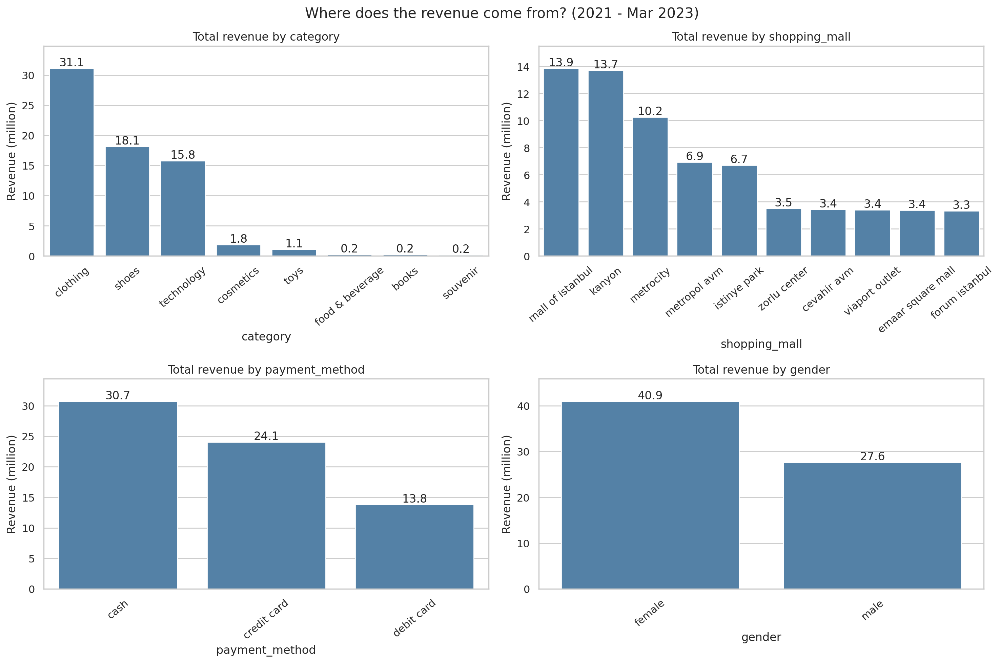
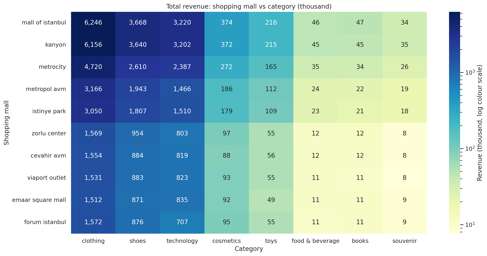
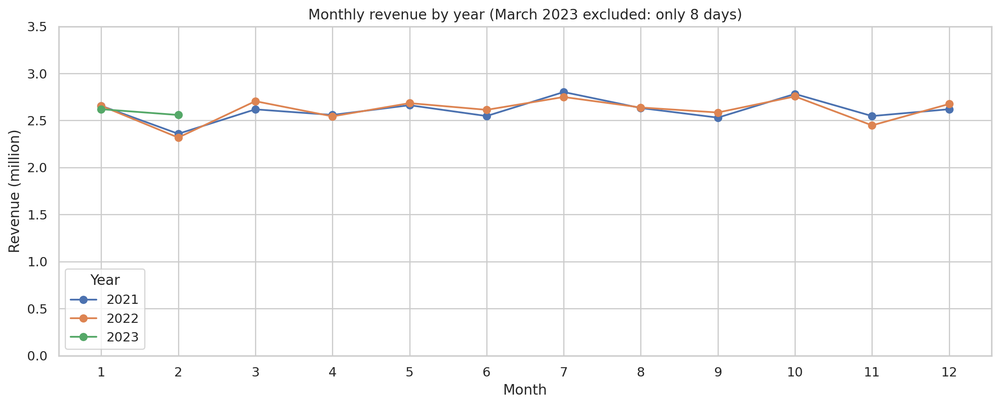
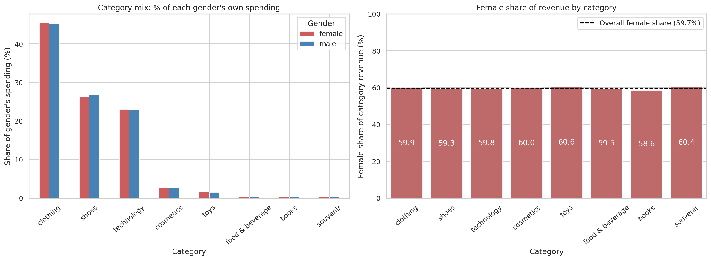

# Charts

Back to the [main README](../README.md). All charts are exported from the [analysis notebook](../notebook/istanbul_analysis.ipynb) as PNG files (200 dpi). "Revenue" is the invoice total (`price`); the currency is not stated in the data. Period: 2021-01-01 to 2023-03-08.

| # | File | Topic |
|---|---|---|
| 01 | [01_revenue_by_dimension.png](01_revenue_by_dimension.png) | Revenue by category, mall, payment method, gender |
| 02 | [02_category_share_and_avg_purchase.png](02_category_share_and_avg_purchase.png) | Category ranking and average purchase |
| 03 | [03_mall_category_revenue_heatmap.png](03_mall_category_revenue_heatmap.png) | Mall × category revenue |
| 04 | [04_yearly_change_and_like_for_like.png](04_yearly_change_and_like_for_like.png) | Yearly change and like-for-like revenue |
| 05 | [05_monthly_revenue_by_year.png](05_monthly_revenue_by_year.png) | Monthly revenue by year |
| 06 | [06_gender_category_mix_and_share.png](06_gender_category_mix_and_share.png) | Male vs female by category |

---

## 01. Revenue by category, shopping mall, payment method and gender

**What it shows:** total revenue (millions) for each value of the four dimensions.

**Key numbers (FACT)**
- Category: clothing 31.1M, shoes 18.1M, technology 15.8M; all other categories are 1.8M or less.
- Mall: Mall of Istanbul 13.9M, Kanyon 13.7M, Metrocity 10.2M, Metropol AVM 6.9M, Istinye Park 6.7M; the other five malls are 3.3–3.5M each.
- Payment: cash 30.7M (44.8%), credit card 24.1M (35.1%), debit card 13.8M (20.1%).
- Gender: female 40.9M (59.7%), male 27.6M (40.3%).

**Takeaway:** only category shows a large structural gap. The gaps between malls, payment methods and genders follow the **number of invoices**, because the average invoice is almost equal (malls 674–705, payment methods 687–691, genders 688–691; see the notebook tables). **INTERPRETATION:** cash leads because it has the most invoices, not because cash customers spend more. Correlation is not causation.

---

## 02. Category ranking and average purchase

**What it shows:** left, each category's share of total revenue (ranked); right, the average invoice amount per category.

**Key numbers (FACT)**
- Revenue share: clothing 45.33%, shoes 26.46%, technology 23.01%, cosmetics 2.70%, toys 1.59%, food & beverage 0.34%, books 0.33%, souvenir 0.25%. The top three add up to 94.8%.
- Average purchase: technology 3,157, shoes 1,807, clothing 901, cosmetics 122, toys 108, books 46, souvenir 35, food & beverage 16.
- Revenue rank differs from invoice-count rank: food & beverage is 3rd by invoices (14,776) but 6th by revenue; technology is 7th by invoices (4,996) but 3rd by revenue.

**Takeaway:** revenue depends on ticket size, not on visit frequency. **INTERPRETATION:** each category has one fixed unit price, so its average purchase is simply unit price × average quantity (about 3).

---

## 03. Mall × category revenue heatmap

**What it shows:** total revenue (thousands) for every mall–category pair. Colours use a **log scale**, otherwise clothing, shoes and technology would hide every other category.

**Key numbers (FACT)**
- Largest cells: Mall of Istanbul clothing 6,246k and Kanyon clothing 6,156k.
- Share of each mall's own revenue: clothing 44.6–47.1%, shoes 25.5–28.0%, technology 21.1–24.6%. The largest gap between malls for any category is 3.5 percentage points (technology).

**Takeaway:** malls differ by **size**, not by **what they sell**. **INTERPRETATION:** the technology gap (lowest in Metropol AVM 21.1%, highest in Emaar Square Mall 24.6%) is a weak signal. No statistical test was run on the mall mix.

---

## 04. Yearly change by category and like-for-like revenue

**What it shows:** left, revenue change from 2021 to 2022 (full years) by category; right, total revenue for the same window, 1 January – 8 March, in 2021, 2022 and 2023. 2023 is only available up to 8 March, so it is never compared with a full year.

**Key numbers (FACT)**
- Total: 31.32M (2021) → 31.37M (2022), **+0.18%**.
- By category: clothing −2.05% (−294,679, the largest absolute drop), food & beverage −0.29%, shoes +1.65%, technology +2.31%, souvenir +2.31%, toys +3.17%, cosmetics +3.30%, books +6.75%.
- Like-for-like (1 Jan – 8 Mar): 5.68M (2021), 5.62M (2022), 5.86M (2023): **+4.3%** vs 2022.

**Takeaway:** revenue is flat year over year, and early 2023 is not weaker than before. **INTERPRETATION:** books' +6.75% is on a base of about 100k and small categories swing a lot, so it is not a trend. About 10 weeks of 2023 data cannot confirm growth, and the data does not explain the clothing dip.

---

## 05. Monthly revenue by year

**What it shows:** total revenue per month, one line per year. March 2023 is left out because it has only 8 days of data (0.68M).

**Key numbers (FACT)**
- Monthly revenue in 2021 and 2022 stays between 2.32M and 2.80M.
- February is the lowest month in both years (2.36M in 2021, 2.32M in 2022). July and October are the two highest months in both years.
- 2023: January 2.62M, February 2.56M.
- Supplementary check on the dataset (not a notebook cell): average revenue **per day** is about 84k in February 2021 and 83k in February 2022, within the 82k–90k range of the other months.

**Takeaway:** **INTERPRETATION:** the February dip is explained by the shorter month, and there is no strong seasonality. With only two full years, seasonal patterns cannot be confirmed.

---

## 06. Male vs female spending across categories

**What it shows:** left, how each gender distributes its own spending across categories; right, the female share of each category's revenue against the overall female share (dashed line, 59.7%).

**Key numbers (FACT)**
- Women are 59.7% of revenue and 59.8% of invoices (59,482 of 99,457).
- Both genders spend about 45% of their total on clothing, 26% on shoes and 23% on technology.
- Female share of category revenue is 58.6% (books) to 60.6% (toys).
- Average invoice per category differs by less than 1% between genders (largest gap: shoes, 1,801 vs 1,817). None of the 8 Welch t-tests is significant (p-values 0.31–0.98; Bonferroni limit 0.05 / 8 = 0.00625).

**Takeaway:** the revenue gap between women and men is a **volume gap** (more female invoices), not a spending gap. **ASSUMPTION / limitation:** why women have more invoices (more female visitors, more frequent shopping or how the data was collected) cannot be answered without footfall data. Correlation is not causation.

