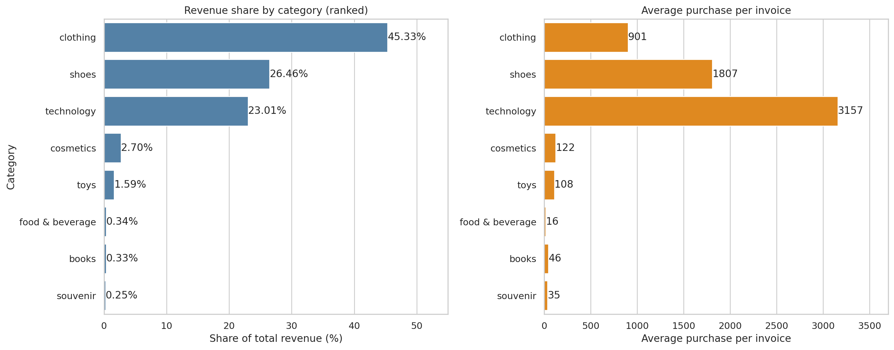
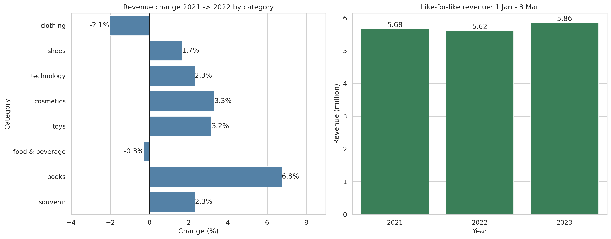

# Multi-Dimensional Retail Analytics: Shopping Mall Revenue (2021 – Mar 2023)

Exploratory and business analysis of **99,457 retail invoices** from **10 shopping malls (AVM)** and **8 product categories**, written in Python. The goal is to show management where revenue comes from and what to do about it.

> **Labels used in this repository:** **FACT** = computed from the data · **INTERPRETATION** = a reading of the facts · **ASSUMPTION** = something taken as true without proof · **BUSINESS ACTION** = a recommendation.

## Business problem and objective

Identify where mall revenue comes from, by category, shopping mall, payment method, gender and time, and turn the findings into actions for AVM management.

**Key business questions**

1. Which categories, malls, payment methods and genders generate the most revenue?
2. What is the average purchase per category, and how do categories rank by revenue?
3. Do malls differ in *what* they sell, or only in *how much*?
4. How did revenue change from 2021 to 2023, by category?
5. Do men and women spend differently across categories?

## Dataset summary

| Item | Value |
|---|---|
| Rows × columns | 99,457 × 10 |
| Period | 2021-01-01 to 2023-03-08 (2023 is a partial year) |
| Malls / categories | 10 / 8 |
| Total revenue | 68,551,366 (currency not stated in the data) |
| Missing values / duplicate rows | 0 / 0 |

Full details: **[dataset/readme.md](dataset/readme.md)**

## Analysis workflow

Load and validate → standardise text and parse dates → validate the price logic → feature engineering → six analysis sections → business insights. Step-by-step description: **[notebook/README.md](notebook/readme.md)**

## Tools and technologies

Python 3.12+ · pandas · NumPy · Matplotlib · Seaborn · SciPy (Welch t-test) · Jupyter Notebook

## Key findings

| # | Finding (all **FACT**) | Chart |
|---|---|---|
| 1 | Clothing, shoes and technology generate **94.8%** of revenue (45.3% / 26.5% / 23.0%). | [02](charts/02_category_share_and_avg_purchase.png) |
| 2 | Mall of Istanbul and Kanyon generate **40.2%** of revenue (20.2% + 20.0%). | [01](charts/01_revenue_by_dimension.png) |
| 3 | Average invoice is almost the same across malls (674–705), payment methods (687–691) and genders (688–691). | [01](charts/01_revenue_by_dimension.png) |
| 4 | Every mall has the same category mix: clothing 44.6–47.1%, shoes 25.5–28.0%, technology 21.1–24.6% of its own revenue. | [03](charts/03_mall_category_revenue_heatmap.png) |
| 5 | Revenue is flat: 31.32M (2021) vs 31.37M (2022), **+0.18%**. Clothing fell 2.05%. Same window 1 Jan–8 Mar: +4.3% in 2023 vs 2022. | [04](charts/04_yearly_change_and_like_for_like.png) |
| 6 | Women generate 59.7% of revenue because they have more invoices (59.8%), not because they spend more per invoice. No category shows a significant gender difference (Welch t-test, Bonferroni limit 0.00625). | [06](charts/06_gender_category_mix_and_share.png) |





## Five actionable business insights for AVM management

**1. Protect the three core categories.**
- **FACT:** clothing, shoes and technology are 94.8% of revenue and 49.8% of invoices.
- **BUSINESS ACTION:** prioritise them in leasing and space decisions and prepare backup plans for key tenants.
- **Confidence:** high for the numbers. Space decisions also need floor-area and rent data, which the dataset does not contain.

**2. High-frequency categories are not major revenue drivers.**
- **FACT:** cosmetics, food & beverage and toys are 40.2% of invoices but only 4.6% of revenue.
- **INTERPRETATION:** they may bring visitors, but the data does not prove it.
- **BUSINESS ACTION:** track footfall and repeat visits, not only revenue, and collect basket-level data to measure cross-selling.

**3. Mall differences are mainly about transaction volume.**
- **FACT:** average invoice is similar across malls, but invoice counts range from 4,811 (Emaar Square Mall) to 19,943 (Mall of Istanbul).
- **ASSUMPTION:** the gap comes from visitor traffic. Footfall data is needed to confirm it.
- **BUSINESS ACTION:** for lower-volume malls, focus on footfall and invoices per month through events, campaigns and accessibility.

**4. Revenue is flat; monitor clothing.**
- **FACT:** +0.18% from 2021 to 2022; clothing −2.05% (the largest absolute drop); Jan–Mar 2023 is +4.3% vs the same period of 2022.
- **INTERPRETATION:** the 2023 window (about 10 weeks) is too short to confirm a trend, and the data gives no reason for the clothing dip.
- **BUSINESS ACTION:** track the top 3 categories monthly and flag declines versus the same period last year.

**5. Gender and payment method have little impact on invoice value.**
- **FACT:** average invoice is 688 (women) vs 691 (men) and 687–691 across cash, credit card and debit card.
- **BUSINESS ACTION:** do not build separate strategies from ticket size alone. Test targeted campaigns against a control group and judge them by incremental revenue and traffic.
- **Confidence:** high for invoice-value differences; medium for the campaign idea, which is a hypothesis to test.

> Correlation is not causation: the insights describe what happens in the data, not why.

## Documentation

| Document | Link |
|---|---|
| Dataset README | [dataset/README.md](dataset/readme.md) |
| Charts README (all charts with explanations) | [charts/README.md](charts/readme.md) |
| Notebook README | [notebook/README.md](notebook/readme.md) |
| Analysis notebook | [notebook/istanbul_analysis.ipynb](notebook/istanbul_analysis.ipynb) |

**Chart images:**
[01 Revenue by dimension](charts/01_revenue_by_dimension.png) ·
[02 Category share and average purchase](charts/02_category_share_and_avg_purchase.png) ·
[03 Mall × category heatmap](charts/03_mall_category_revenue_heatmap.png) ·
[04 Yearly change and like-for-like](charts/04_yearly_change_and_like_for_like.png) ·
[05 Monthly revenue by year](charts/05_monthly_revenue_by_year.png) ·
[06 Gender category mix](charts/06_gender_category_mix_and_share.png)

## Project structure

```text
mall-retail-analytics/
├── README.md
├── .gitignore
├── dataset/
│   ├── customer_shopping_data.csv
│   └── README.md
├── charts/
│   ├── 01_revenue_by_dimension.png
│   ├── 02_category_share_and_avg_purchase.png
│   ├── 03_mall_category_revenue_heatmap.png
│   ├── 04_yearly_change_and_like_for_like.png
│   ├── 05_monthly_revenue_by_year.png
│   ├── 06_gender_category_mix_and_share.png
│   └── README.md
└── notebook/
    ├── istanbul_analysis.ipynb
    └── README.md
```

## How to run

```bash
pip install pandas numpy matplotlib seaborn scipy jupyter
cd notebook
jupyter notebook istanbul_analysis.ipynb
```

Run the notebook from the `notebook/` folder: it reads the data from `../dataset/`.

