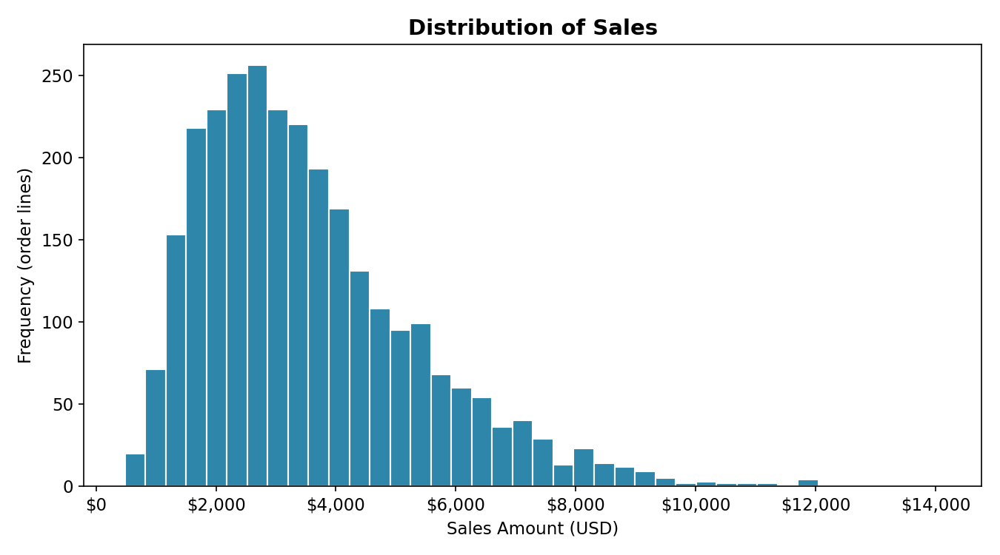
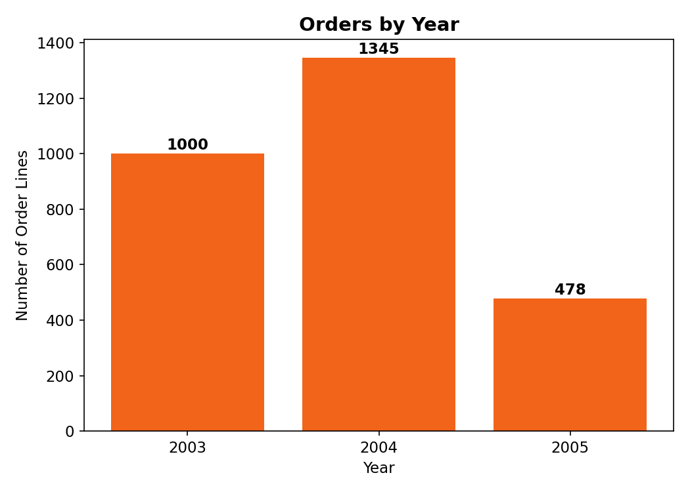
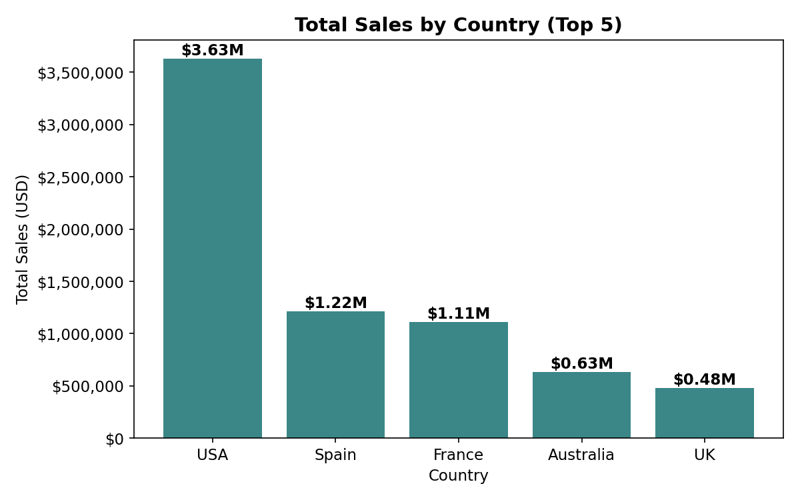
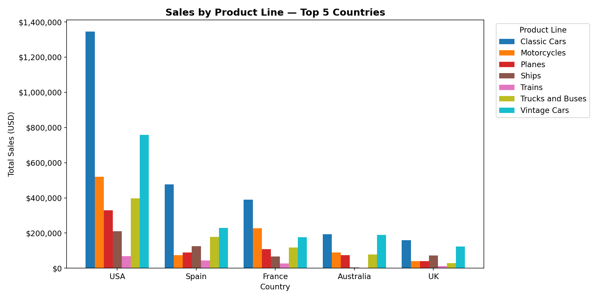
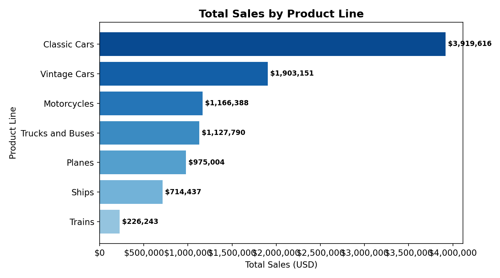
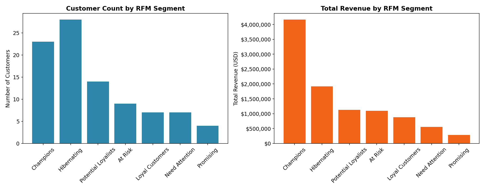
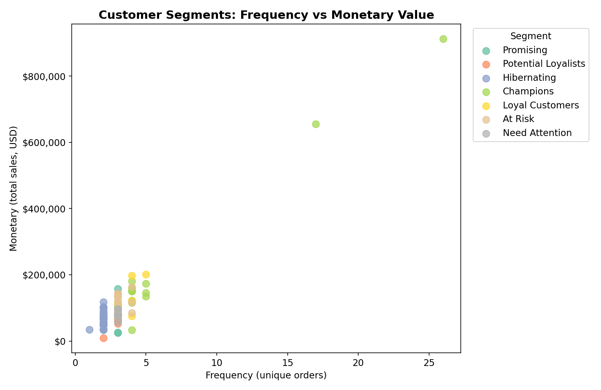

# Charts Documentation

This document explains every visualization produced in [`task1_main_Ədalət.ipynb`](../notebooks/task1_main_Ədalət.ipynb), what each chart shows, how it was built, and what business insight it supports. Charts were built interactively with **Plotly** inside the notebook; the static `.png` versions in this folder are matplotlib re-exports of the same data for GitHub viewing.

## Dataset Context (for reference)

All charts below are built from `sales_data_sample.csv` — 2,823 order-line rows spanning 307 unique orders, 92 unique customers, 19 countries, and 7 product lines, covering **2003–2005** (2005 is incomplete, Jan–May only). See the [main README](../README.md#dataset) for the full column reference and cleaning steps applied before these charts were built.

---

## 01. Distribution of Sales

**What it shows:** A histogram of the `sales` column (40 bins) — the dollar value of every individual order line in the dataset.

**How it's built:** `px.histogram(data, x='sales', nbins=40)`

**What it means:**
- The distribution is **right-skewed**: most order lines cluster between roughly $2,000–$4,500, with a long tail extending toward $14,000+
- **Mean ($3,553.89) > Median ($3,184.80)** — this gap is the numerical signature of the skew. A small number of high-value orders pull the average upward, so the median is a more representative "typical order" figure than the mean
- **Takeaway:** When reporting a single "average order value" for this business, prefer the median or report both — the mean alone overstates what a typical transaction looks like

---

## 02. Orders by Year

**What it shows:** The count of order-line rows per year (`year_id`).

**How it's built:** `data['year_id'].value_counts()`, sorted chronologically (not by frequency), then plotted as a bar chart.

**What it means:**
- 2003: 1,000 order lines · 2004: 1,345 order lines · 2005: 478 order lines
- 2004 has the highest order volume
- **Critical caveat:** 2005's lower count is **not** a business decline — the dataset only contains January–May 2005 (confirmed via `month_year` grouping in the notebook). Comparing 2005's total directly against the two full years (2003, 2004) would be misleading
- **Takeaway:** Any year-over-year growth/decline narrative must either exclude 2005 or annualize it (e.g., 478 orders over 5 months ≈ 1,147 orders annualized, which is roughly in line with 2003–2004)

---

## 03. Total Sales by Country (Top 5)

**What it shows:** Total sales revenue for the five highest-performing countries.

**How it's built:** `data.groupby('country')['sales'].sum()`, sorted descending, top 5 selected.

**What it means:**
- **USA: $3.63M** — roughly **3× larger** than the next country, Spain ($1.22M), followed by France ($1.11M), Australia ($0.63M), and the UK ($0.48M)
- **Takeaway:** The business is heavily concentrated in a single market (USA). This is a geographic concentration risk — a downturn in the US market would disproportionately affect total revenue, and it also suggests an opportunity: growth in the #2–#5 markets could meaningfully diversify revenue

---

## 04. Sales by Product Line — Top 5 Countries

**What it shows:** Within each of the top 5 countries, how revenue breaks down across the 7 product lines (grouped/clustered bars, not stacked — so each product line's contribution is directly comparable across countries).

**How it's built:** `data.groupby(['country','productline'])['sales'].sum()`, filtered to the top 5 countries by total sales, plotted with `barmode='group'`.

**What it means:**
- **Classic Cars** is the leading product line in the USA specifically, representing **~33%** of total USA sales
- The relative ranking of product lines is broadly similar across the top markets, suggesting demand patterns are not strongly country-specific among these top 5
- **Takeaway:** Product strategy (e.g., inventory prioritization, marketing focus) built around Classic Cars and Vintage Cars is well-aligned with where the revenue actually comes from, across all major markets — not just the USA

---

## 05. Total Sales by Product Line

**What it shows:** Total revenue generated by each of the 7 product lines, across all countries and all years.

**How it's built:** `data.groupby('productline')['sales'].sum()`, sorted ascending, plotted as a horizontal bar chart.

**What it means:**
- **Classic Cars ($3.92M)** and **Vintage Cars ($1.90M)** are the two strongest product lines — together they account for more revenue than the other five product lines combined
- **Trains ($0.23M)** is the smallest contributor by a wide margin
- **Takeaway:** Product-line revenue is concentrated, not evenly spread across the 7 lines — this mirrors the geographic concentration seen in Chart 03 and reinforces that this business currently depends on a narrow set of "hero" categories

---

## 06. RFM Segment Overview (Customer Count & Revenue)

**What it shows:** Two side-by-side panels — the number of customers in each RFM segment (left), and the total revenue each segment generates (right).

**How it's built:** Customers are scored on Recency, Frequency, and Monetary value (each split into 5 quantile-based scores), then mapped into 7 named segments using a rule-based classifier (see the notebook's `assign_segment()` function). Aggregated with `rfm.groupby('segment')`.

**What it means:**
- **Champions** (23 customers) generate **$4.16M — 41.5% of all revenue** — by far the highest revenue concentration relative to customer count
- **Hibernating** is the largest segment by customer count (28) but contributes only 19.1% of revenue — these are customers who have gone quiet
- The clear mismatch between the left panel (customer count) and right panel (revenue) for segments like Champions vs. Hibernating is the core insight of RFM: **not all customers are worth the same retention effort**
- **Takeaway:** Retention and marketing budget should be weighted toward Champions (protect the revenue base) and At Risk (recover previously valuable customers before they become Hibernating), rather than spread evenly across all 92 customers

---

## 07. Customer Segments: Frequency vs Monetary Value

**What it shows:** Every individual customer plotted by order frequency (x-axis) against total spend (y-axis), colored by their assigned RFM segment.

**How it's built:** `px.scatter(rfm, x='frequency', y='monetary', color='segment')`

**What it means:**
- **Champions** (visually) cluster toward the upper-right — high frequency and high monetary value together, confirming the segment definition is behaving as intended
- **Hibernating** and **Promising** customers cluster toward the lower-left — low frequency, low spend
- A handful of high-monetary, lower-frequency customers appear as outliers — these are customers who spend a lot in very few (sometimes single) large orders, worth a closer individual look rather than a purely rule-based segment label
- **Takeaway:** The scatter plot is a good sanity check for the segmentation rules — it visually confirms that the Champions segment isn't an artifact of the scoring thresholds, but reflects customers who are genuinely both frequent and high-spending

---

## Methodological Note on RFM Calculation

The `recency`, `frequency`, and `monetary` values must be preserved in their **original units** (days, order count, dollars) for the segment-level aggregates (total revenue, average recency, etc.) to be meaningful. An earlier draft of this analysis overwrote these columns with their rank positions (1–92) before aggregating, which caused the reported segment revenue to reflect **rank sums rather than real dollars** (e.g. "$695" instead of the true ~$4.16M for Champions). The fix — computing ranks into separate `_rank` helper columns used only for the 1–5 quantile scoring step — is what produces the figures shown in this document. Anyone extending this analysis should keep that separation intact.

