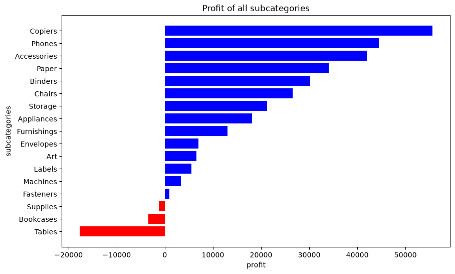
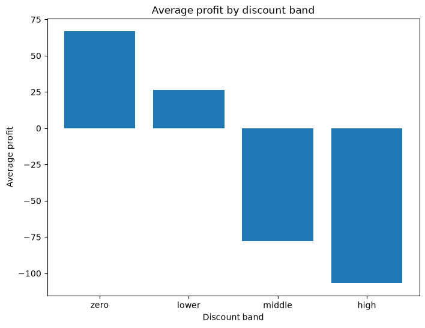
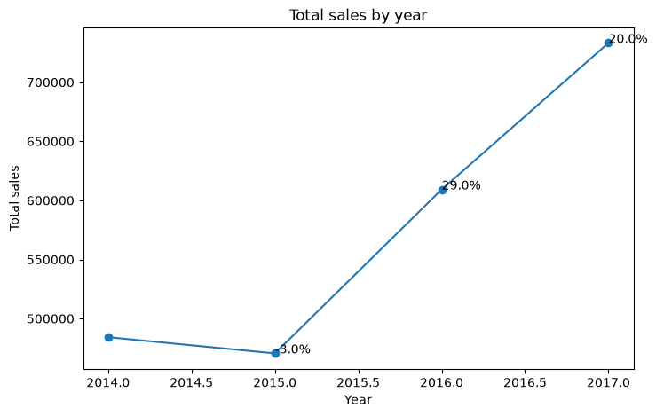

# Charts

3 visualizations exported from `/notebook/sql.ipynb` (cells 18–20). Each is built directly from a query result already covered in `/sql/README.md` and `/notebook/README.md`.

---

## 1. Profit by sub-category

**Source:** `sum(profit)` grouped by `sub_category` over the full `SUPERSTORE` table (17 sub-categories).
**Chart type:** horizontal bar (`plt.barh`), sorted ascending by profit; bars colored red when profit `< 0`, blue otherwise.

**Reading it:** Copiers is the strongest sub-category at **+$55,617.82**; Tables is the weakest at **-$17,725.48**. Three of the 17 sub-categories are net-negative — Tables, Bookcases, Supplies — everything else is profitable to some degree. The red/blue split makes the loss-makers immediately visible against the 14 profitable sub-categories.

---

## 2. Average profit by discount band

**Source:** Q7 result — order lines bucketed into 4 discount bands (`zero`, `lower` = 1–20%, `middle` = 21–40%, `high` = 41%+) via `CASE WHEN`, averaged per band. Bands are cast to an ordered categorical (`zero → lower → middle → high`) before plotting so the x-axis follows discount severity rather than alphabetical order.
**Chart type:** vertical bar (`plt.bar`).

**Reading it:** average profit per line falls monotonically as the discount band increases — **zero: +$66.90 → lower: +$26.50 → middle: -$77.86 → high: -$106.71**. The two highest bands are net-negative on average. This is a correlation, not a proven causal effect of discounting on profit — see the causation note in `/notebook/README.md`.

---

## 3. Total sales by year, with YoY % change

**Source:** Q8 result — total `sales` per year, with each point annotated by its year-over-year % change (computed with `LAG()` in SQL).
**Chart type:** line chart with markers (`plt.plot`), YoY % labels placed at each point via `plt.annotate`.

**Reading it:** sales dipped from $484.2K (2014) to $470.5K in 2015 (**-3.0%**), then recovered to $609.2K in 2016 (**+29.0%**) and $733.2K in 2017 (**+20.0%**). The recovery is real but decelerating — growth dropped 9 points from 2016 to 2017. Note this chart shows revenue only; check `/notebook/README.md` for the matching profit-margin trend (margin peaked in 2016 at 13.4%, not 2017), since sales growth and margin growth moved in different directions.
