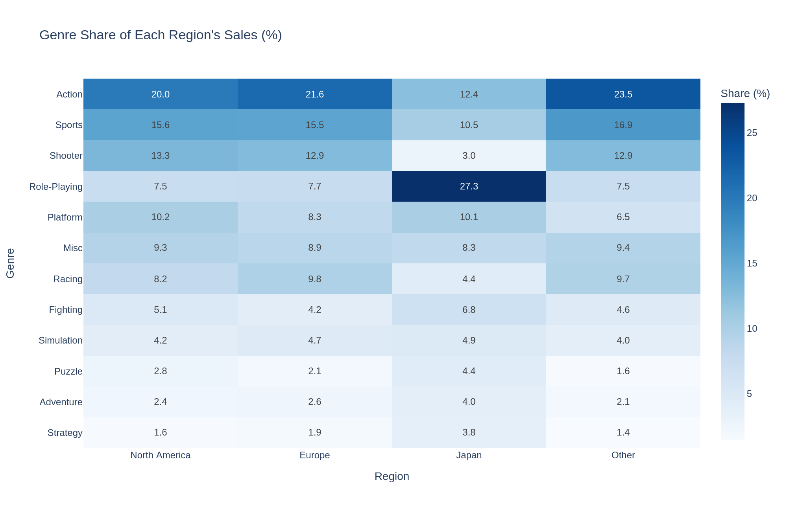
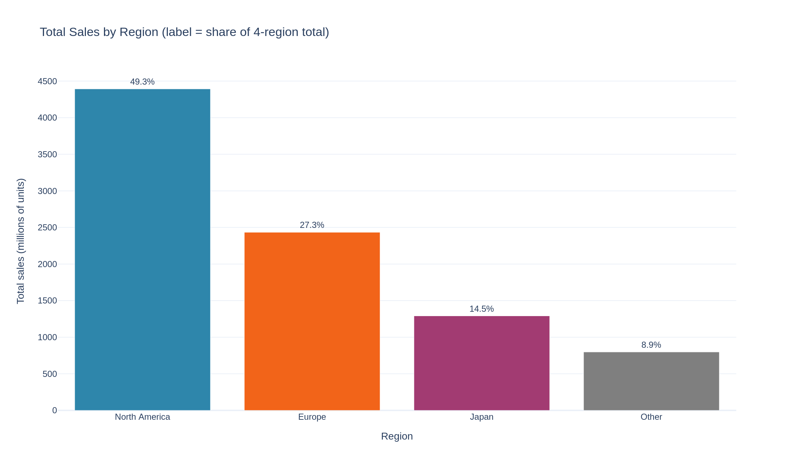
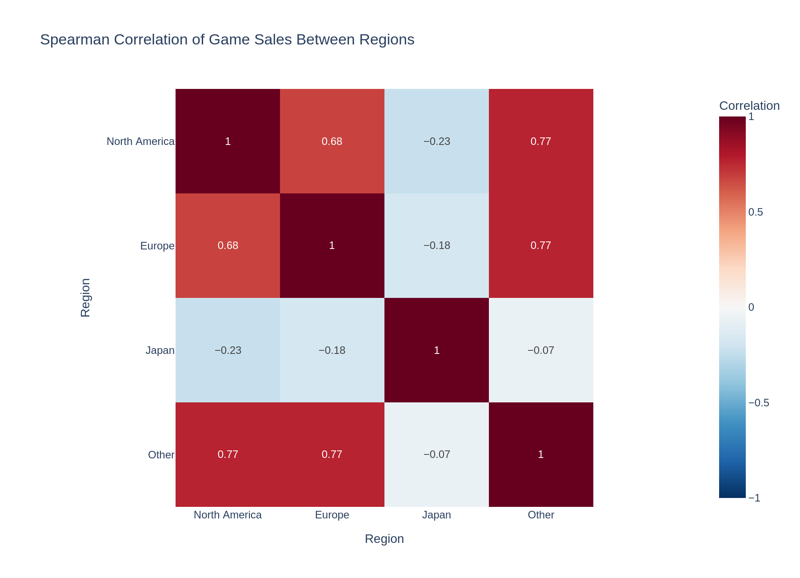

# Video Game Sales: Regional Breakdown

Descriptive analysis of 16,598 video games to show **where in the world each genre, platform and publisher sells**, comparing North America, Europe, Japan and the rest of the world.



## Project objective

Compare regional video game markets by size, genre mix, platform mix, publisher structure and development over time, and keep **facts** (what the numbers show) separate from **interpretations** (what they might mean). The analysis is descriptive: the dataset has no price, marketing or release-region information, so it can show *where* sales are concentrated, not *why*.

## Dataset

[`data/vgsales.csv`](dataset/vgsales.csv): 16,598 rows × 11 columns, one row per game and platform, sales in **millions of units**. Columns: `Rank`, `Name`, `Platform`, `Year`, `Genre`, `Publisher`, `NA_Sales`, `EU_Sales`, `JP_Sales`, `Other_Sales`, `Global_Sales`. Missing values: `Year` 271 rows (1.6%), `Publisher` 58 rows (0.3%). Full description in [`data/README.md`](dataset/README.md).

## Tools and technologies

Python, pandas, Plotly (Express and Graph Objects), Jupyter Notebook, pandas for the statistics (no SciPy needed). Charts exported to PNG with Kaleido. See [`requirements.txt`](requirements.txt).

## Analytical methodology

1. **Overview and cleaning:** inspect shape, dtypes, nulls, duplicates and ranges before changing anything; every cleaning decision is documented with a count and a reason
2. **Consistency checks:** the 4 regions vs `global_sales`, incomplete release years, repeated game-platform pairs
3. **Regional statistics:** totals, mean vs median, share of `0.00` games
4. **Breakdowns:** genre, platform, publisher (totals and **within-region shares**), release year and decade, top games
5. **Relationship between regions:** Spearman correlation (sales are right-skewed), checked again on games sold in both regions
6. **Guards:** shares use the 4-region sum as 100%; year analysis limited to 1980–2015; small 1980s base flagged; top-10 platform view cross-checked against all platforms with at least 100M units

## Key questions investigated

- How large is each regional market, and how skewed are sales inside it?
- Does genre taste differ between regions?
- Which platforms and publishers dominate each region?
- How do sales and the regional mix change over release years?
- Do games that sell in one region also sell in the others?

## Major findings

**Facts**

| # | Finding |
| - | ------- |
| 1 | North America is **49.3%** of sales (4,393.0M units), Europe 27.3%, Japan 14.5%, Other 8.9% |
| 2 | Sales are right-skewed in every region (North America mean 0.26M vs median 0.08M). **63.0%** of games have `0.00` sales in Japan, against 27.1% in North America |
| 3 | `Action` leads North America, Europe and Other. In Japan, `Role-Playing` is **27.3%** of sales (about 7.5% elsewhere) and `Shooter` only 3.0% (12.9–13.3% elsewhere) |
| 4 | `X360` is 61.4% North America; `PC` is 54.1% Europe. Japan's share is highest on Nintendo platforms: `SNES` 58.3%, `3DS` 39.4%, `NES` 39.3%, `GB` 33.3% |
| 5 | `Nintendo` is number 1 in North America, Europe and Japan (35.3% of Japan sales); `Electronic Arts` is number 1 in Other |
| 6 | North America, Europe and Other peak in 2008–2009 by release year, Japan in 2006 |
| 7 | Europe's share rises every decade (8.3% → 33.2%); Japan's falls from about 29% (1990s) to 11–12% |



**Interpretations (not tested)**

- Many titles are probably specific to one market, which would explain Japan's zeros and weak overlap with other regions. The file has no release-region column
- Europe's rising share may partly reflect better tracking of Europe in the source: the 1980s base is only 205 games
- The decline after 2009 is probably affected by missing digital sales and by newer games having less time to sell

## Important statistical results

No hypothesis tests were run; all comparisons are descriptive.

| Result | Value |
| ------ | ----- |
| Spearman, North America – Europe / Other | 0.68 / 0.77 |
| Spearman, Europe – Other | 0.77 |
| Spearman, Japan – North America / Europe / Other (all games) | −0.23 / −0.18 / −0.07 |
| Spearman, Japan – North America / Europe / Other (games sold in both regions) | 0.21 / 0.13 / 0.02 |
| Games with sales in Japan but `0.00` in North America | 3,458 |
| Games with sales in North America but `0.00` in Japan | 9,414 |

Japan's negative values come mostly from ties: 63.0% of its values are `0.00`. Spearman is used because Pearson is pulled up by a few blockbusters (Pearson shows 0.29–0.77 for all pairs).



## Business and analytical conclusions

- Regional markets differ in size, genre, platform and publisher mix. **Japan is the most different** in every dimension tested
- Hypotheses to test with a small pilot, not conclusions: weight a Japan line-up towards `Role-Playing`; test `PC` and `PS4` first for Europe-focused titles (54.1% and 44.5% of their sales are in Europe vs 27.3% for the market as a whole). Shares do not prove that genre or platform causes the difference
- Before any Japan launch decision, release-region data is needed: the file cannot separate "not released" from "released and sold very little"
- Limitations: lifetime sales grouped by release year (not yearly sales), possibly missing digital sales, one row per game-platform pair, 2016 onwards excluded from the time analysis, correlation is not causation

## Repository structure

```
vgsales-regional-analysis/
├── README.md
├── requirements.txt
├── data/
│   ├── vgsales.csv
│   └── README.md
├── notebook/
│   ├── Regional_Sales_Breakdown.ipynb
│   └── README.md
└── charts/
    ├── 01_total_sales_by_region.png
    ├── 02_zero_sales_share_by_region.png
    ├── 03_sales_by_genre_and_region.png
    ├── 04_genre_share_heatmap.png
    ├── 05_top10_platform_regional_split.png
    ├── 06_top5_publishers_by_region.png
    ├── 07_sales_by_release_year.png
    ├── 08_regional_share_by_decade.png
    ├── 09_spearman_correlation_heatmap.png
    └── README.md
```

| Item | Link | Documentation |
| ---- | ---- | ------------- |
| Notebook | [`notebook/Regional_Sales_Breakdown.ipynb`](notebook/Regional_Sales_Breakdown.ipynb) | [`notebook/README.md`](notebook/README.md) |
| Dataset | [`data/vgsales.csv`](data/vgsales.csv) | [`data/README.md`](data/README.md) |
| Charts (9 PNG) | [`charts/`](charts/) | [`charts/README.md`](charts/README.md) |

## How to reproduce

```bash
pip install -r requirements.txt
cd notebook
jupyter notebook Regional_Sales_Breakdown.ipynb   # run all cells
```

