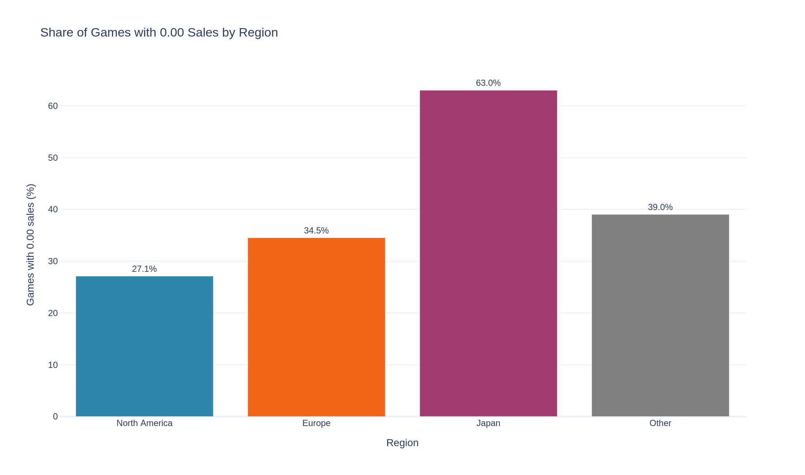
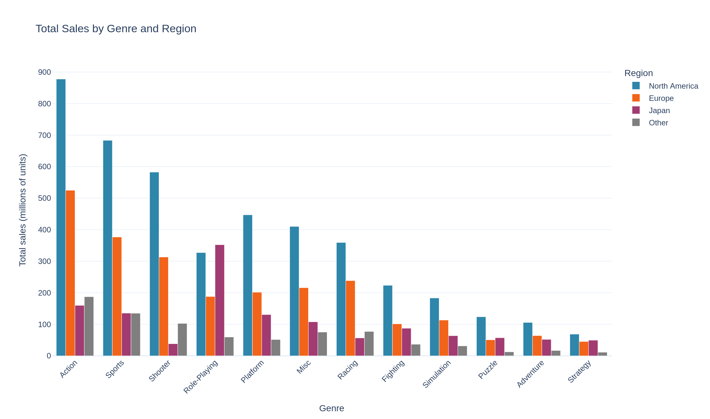
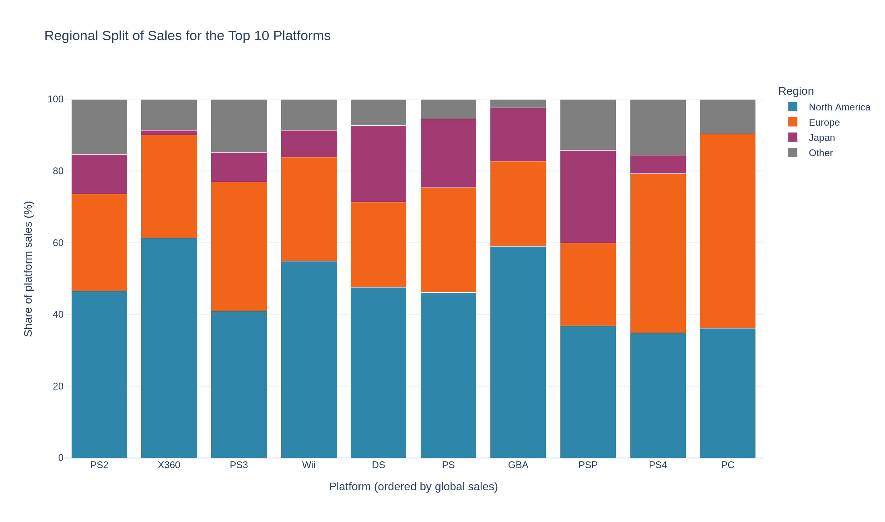
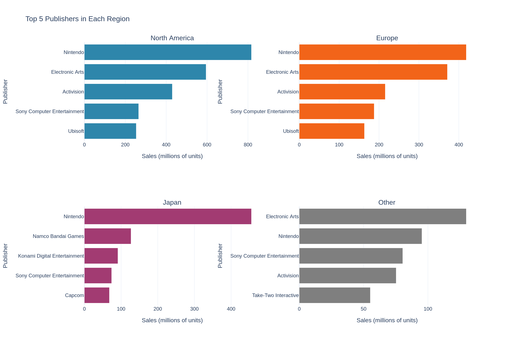
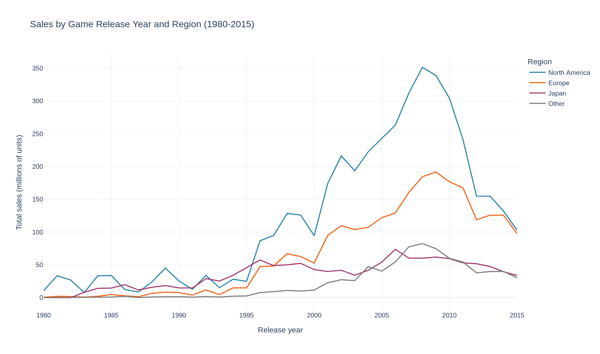
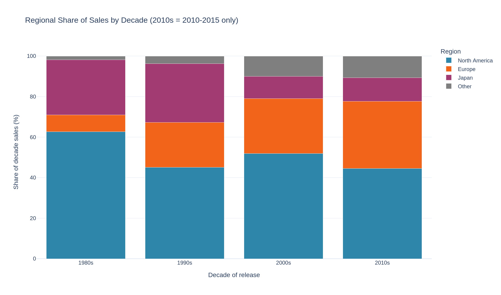

# Charts

Nine charts from [`notebook/Regional_Sales_Breakdown.ipynb`](../notebook/Regional_Sales_Breakdown.ipynb), exported as PNG (2× scale, white background). The variable name in the notebook is given for each chart, so every image can be traced to its cell.

All sales are in **millions of units**. Region colors are the same in every chart: North America `#2E86AB`, Europe `#F26419`, Japan `#A23B72`, Other `#7F7F7F`. Shares use the **sum of the 4 regions** as 100% (see [`data/README.md`](../dataset/readme.md)).

| # | File | Notebook variable | Question |
| - | ---- | ----------------- | -------- |
| 1 | [`01_total_sales_by_region.png`](01_total_sales_by_region.png) | `fig_region` | How big is each market? |
| 2 | [`02_zero_sales_share_by_region.png`](02_zero_sales_share_by_region.png) | `fig_zero` | How many games sell almost nothing in each region? |
| 3 | [`03_sales_by_genre_and_region.png`](03_sales_by_genre_and_region.png) | `fig_genre` | Which genres sell the most, in absolute terms? |
| 4 | [`04_genre_share_heatmap.png`](04_genre_share_heatmap.png) | `fig_genre_share` | How does genre **taste** differ between regions? |
| 5 | [`05_top10_platform_regional_split.png`](05_top10_platform_regional_split.png) | `fig_platform` | Where are the top platforms sold? |
| 6 | [`06_top5_publishers_by_region.png`](06_top5_publishers_by_region.png) | `fig_publisher` | Who are the leading publishers in each region? |
| 7 | [`07_sales_by_release_year.png`](07_sales_by_release_year.png) | `fig_year` | How do sales develop over release years? |
| 8 | [`08_regional_share_by_decade.png`](08_regional_share_by_decade.png) | `fig_decade` | How does the regional mix change by decade? |
| 9 | [`09_spearman_correlation_heatmap.png`](09_spearman_correlation_heatmap.png) | `fig_corr` | Do hits in one region sell in the others? |

---

## 1. Total sales by region

- **Shows:** total sales per region. Bar labels are the share of the 4-region total.
- **Variables:** `region` (x), `total_sales` in M units (y), `share_pct` (label).
- **Purpose:** set the size of each market before comparing anything else.
- **Key insight (fact):** North America is **49.3%** of sales (4,393.0M), Europe 27.3% (2,434.1M), Japan 14.5% (1,291.0M), Other 8.9% (797.8M). North America sells about 1.8 times Europe and 3.4 times Japan.
- **Context:** absolute sales mostly reflect market size, so later charts use shares to compare taste.

## 2. Share of games with 0.00 sales

- **Shows:** the share of games recorded with `0.00` sales in each region.
- **Variables:** `region` (x), `zero_sales_pct` (y). `0.00` means below 5,000 units, because values are rounded to 0.01M.
- **Purpose:** show how skewed and how sparse the sales are per region.
- **Key insight (fact):** **63.0%** of games have `0.00` sales in Japan, against 27.1% in North America, 34.5% in Europe and 39.0% in Other. Japan's median game sells 0.00M, North America's 0.08M.
- **Interpretation / context:** the data cannot say whether those games were never released in Japan or were released and sold very little. This is a fact about the dataset, not a statement about how selective the Japanese market is.

## 3. Total sales by genre and region

- **Shows:** grouped bars of total sales for each of the 12 genres, split by region, ordered by total.
- **Variables:** `genre` (x), `sales` in M units (y), `region` (color).
- **Purpose:** find the genres that carry the market in absolute terms.
- **Key insight (fact):** `Action` (1,750.2M), `Sports` (1,330.5M) and `Shooter` (1,036.8M) together are 4,117.5M units, **46.2%** of all sales. In Japan, `Role-Playing` (352.3M) is bigger than `Action` (160.0M).
- **Context:** North America dominates every genre except Japan's `Role-Playing`, so this chart mostly shows market size. Chart 4 removes that effect.

## 4. Genre share inside each region

- **Shows:** heatmap of the share each genre has inside one region's sales. Each column adds up to 100%.
- **Variables:** `genre` (rows), `region` (columns), share in % (color and label).
- **Purpose:** compare **taste** between regions independently of market size.
- **Key insight (fact):**
  - `Action` is number 1 in North America (20.0%), Europe (21.6%) and Other (23.5%)
  - Japan is different: `Role-Playing` is **27.3%** of its sales, against about 7.5% in the other three regions
  - `Shooter` is only **3.0%** in Japan, against 12.9–13.3% elsewhere
  - `Puzzle`, `Strategy` and `Adventure` have a higher share in Japan (4.4%, 3.8%, 4.0%), but all three are small genres
- **Interpretation / context:** shares describe where sales are concentrated; they do not show that genre causes the difference.

## 5. Regional split of the top 10 platforms

- **Shows:** for the 10 platforms with the highest `global_sales`, the share of each region in that platform's sales. Bars add up to 100%.
- **Variables:** `platform` (x, ordered by global sales), `share_pct` (y), `region` (color).
- **Purpose:** see how strongly a platform depends on one region.
- **Key insight (fact):**
  - `X360` is 61.4% North America and only 1.3% Japan
  - `PC` is **54.1%** Europe and 0.1% Japan; `PS4` is 44.5% Europe against 34.8% North America
  - Within the top 10, Japan's share is highest on `PSP` (25.9%) and `DS` (21.4%)
- **Interpretation / context:** the top-10 filter hides Japan-heavy platforms. Ranking **all** 18 platforms with at least 100M units by Japan share gives `SNES` 58.3%, `3DS` 39.4%, `NES` 39.3%, `GB` 33.3% (calculated in the notebook, not shown in this chart). Platform shares also reflect availability: a platform not sold in a region cannot sell there.

## 6. Top 5 publishers in each region

- **Shows:** four panels, one per region, with the five publishers with the highest sales in that region.
- **Variables:** `publisher` (y), `sales` in M units (x). Each panel has its own x-axis scale.
- **Purpose:** compare publisher concentration between regions.
- **Key insight (fact):**
  - `Nintendo` is number 1 in North America (816.9M, 18.6%), Europe (418.7M, 17.2%) and Japan (455.4M, **35.3%**)
  - `Electronic Arts` is number 2 in North America and Europe, and number 1 in Other (129.8M, 16.3%)
  - Japan's next four are `Namco Bandai Games` (9.8%), `Konami Digital Entertainment` (7.1%), `Sony Computer Entertainment` (5.7%) and `Capcom` (5.3%); `Electronic Arts` and `Activision` are not in the Japan top 5
- **Context:** because the x-axis differs per panel, compare the rank order and the shares in the text, not the bar lengths across panels.

## 7. Sales by game release year

- **Shows:** one line per region with total sales of the games released in each year, 1980–2015.
- **Variables:** `year` (x), `sales` in M units (y), `region` (color).
- **Purpose:** show when each market peaked.
- **Key insight (fact):** North America peaks in 2008 (351.4M), Europe in 2009 (191.6M), Other in 2008 (82.4M) and Japan earlier, in 2006 (73.7M). After the peak sales fall: North America goes from 351.4M (2008) to 102.8M (2015). Japan is flatter, staying near 60M in 2007–2010 before dropping to 33.7M in 2015.
- **Interpretation / context:** sales are **lifetime sales of each game grouped by release year**, not yearly sales. The decline should not be read as a market collapse: the file has no digital sales information and newer games have had less time to collect sales. Years after 2015 are excluded because 2016 is incomplete.

## 8. Regional share by decade

- **Shows:** stacked bars of each region's share of sales for games released in each decade (the 2010s are 2010–2015 only).
- **Variables:** `decade` (x), `share_pct` (y), `region` (color).
- **Purpose:** check how the regional mix changes over time.
- **Key insight (fact):**

| Decade | North America | Europe | Japan | Other | Games | Total (M units) |
| ------ | ------------: | -----: | ----: | ----: | ----: | --------------: |
| 1980s | 62.6% | 8.3% | 27.2% | 1.9% | 205 | 376.6 |
| 1990s | 45.1% | 22.1% | 29.1% | 3.7% | 1,769 | 1,278.9 |
| 2000s | 51.9% | 27.1% | 11.0% | 10.0% | 9,208 | 4,644.0 |
| 2010s | 44.5% | 33.2% | 11.6% | 10.7% | 4,797 | 2,449.6 |

  Europe's share grows in every decade (8.3% → 33.2%), Japan's falls from about 29% (1990s) to about 11–12%.
- **Interpretation / context:** the 1980s are a small base (205 games). Early Europe and Other shares may partly reflect how well the source tracked those regions, not only real market size. The long-run Europe trend is a **hypothesis**, not a proven market shift.

## 9. Spearman correlation between regions

- **Shows:** rank (Spearman) correlation of per-game sales between each pair of regions, for all 16,598 rows.
- **Variables:** `na_sales`, `eu_sales`, `jp_sales`, `other_sales`; correlation from −1 to 1.
- **Purpose:** check whether a game that sells in one region also sells in the others. Spearman is used because sales are right-skewed; Pearson is pulled up by a few blockbusters.
- **Key insight (fact):** North America, Europe and Other are positively related (**0.68–0.77**). Japan is **negative** with all three (−0.23 with North America, −0.18 with Europe, −0.07 with Other).
- **Interpretation / context:** the negative values come mostly from zeros: 63.0% of Japan's values are tied at `0.00`. Restricted to games with sales above 0 in **both** regions (calculated in the notebook), Japan's Spearman is weak but positive: 0.21 with North America (2,685 games), 0.13 with Europe, 0.02 with Other, while the three Western-market pairs stay at 0.67–0.76. 9,414 games have North America sales but `0.00` in Japan, and 3,458 the other way round. A plausible reading is that many titles are specific to one market, but the file has no release-region column, so this is **not tested**. Correlation is not causation.

