# Charts

All 11 charts of the analysis, exported as PNG images from the Plotly figures stored in [`notebooks/Revenue_Analysis.ipynb`](../notebooks/Revenue_Analysis.ipynb). Each chart has its own README that explains what it shows, the numbers behind it, the key findings and the business meaning.

[← Project README](../README.md) · [Insights and Results](../INSIGHTS_AND_RESULTS.md)

## Index

| # | Chart (README) | Notebook section | PNG file |
|---|---|---|---|
| 01 | [Monthly Net Revenue and Order Count](01_monthly_net_revenue_and_orders.md) | 2.2 Monthly trend | [`01_monthly_net_revenue_and_orders.png`](01_monthly_net_revenue_and_orders.png) |
| 02 | [Top 10 Non-UK Countries by Net Revenue](02_top10_non_uk_countries_net_revenue.md) | 2.3 Revenue by country | [`02_top10_non_uk_countries_net_revenue.png`](02_top10_non_uk_countries_net_revenue.png) |
| 03 | [Top 10 Products by Net Revenue](03_top10_products_net_revenue.md) | 2.4 Products | [`03_top10_products_net_revenue.png`](03_top10_products_net_revenue.png) |
| 04 | [Cumulative Net Revenue Share by Product Rank (Pareto Curve)](04_product_pareto_curve.md) | 2.4 Products | [`04_product_pareto_curve.png`](04_product_pareto_curve.png) |
| 05 | [Net Revenue by Weekday and by Hour of Day](05_net_revenue_by_weekday_and_hour.md) | 2.5 When customers buy | [`05_net_revenue_by_weekday_and_hour.png`](05_net_revenue_by_weekday_and_hour.png) |
| 06 | [Monthly Return Rate by Value](06_monthly_return_rate.md) | 2.6 Returns | [`06_monthly_return_rate.png`](06_monthly_return_rate.png) |
| 07 | [Cumulative Net Revenue Share by Customer Rank](07_customer_revenue_concentration_curve.md) | 3.2 Revenue concentration | [`07_customer_revenue_concentration_curve.png`](07_customer_revenue_concentration_curve.png) |
| 08 | [Share of Customers vs Share of Net Revenue by Number of Orders](08_customer_vs_revenue_share_by_order_count.md) | 3.3 Repeat behaviour | [`08_customer_vs_revenue_share_by_order_count.png`](08_customer_vs_revenue_share_by_order_count.png) |
| 09 | [RFM Segments: Recency vs Frequency](09_rfm_segments_bubble_chart.md) | 3.4 RFM segmentation | [`09_rfm_segments_bubble_chart.png`](09_rfm_segments_bubble_chart.png) |
| 10 | [Monthly Cohort Retention Heatmap](10_cohort_retention_heatmap.md) | 3.5 Cohort retention | [`10_cohort_retention_heatmap.png`](10_cohort_retention_heatmap.png) |
| 11 | [Spearman Correlation Between Customer Metrics](11_spearman_correlation_heatmap.md) | 4.3 Which customer metrics move together? | [`11_spearman_correlation_heatmap.png`](11_spearman_correlation_heatmap.png) |

## Folder layout

```
charts/
├── README.md          
├── charts of datas               
└── readmes of each chart           one README per chart
```

## How the PNGs were produced

The notebook stores each chart as an interactive Plotly figure. [`scripts/export_charts.py`](../scripts/export_charts.py) reads those figures from the notebook and writes static PNGs (1200 x 720 px, 2x scale). Chart data and styling are unchanged, with three presentation-only adjustments: charts 01, 06 and 10 use category axes so that every month/cohort label is shown, and chart 10 has extra top margin so the title does not overlap the axis title.

## Gallery

### Chart 01 — Monthly Net Revenue and Order Count
[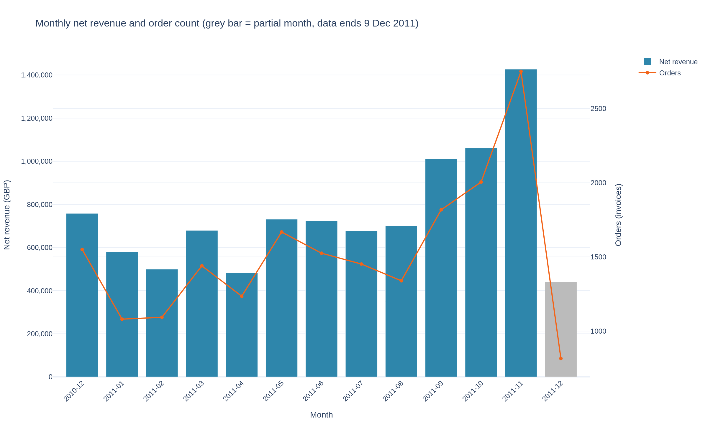](01_monthly_net_revenue_and_orders.md)

### Chart 02 — Top 10 Non-UK Countries by Net Revenue
[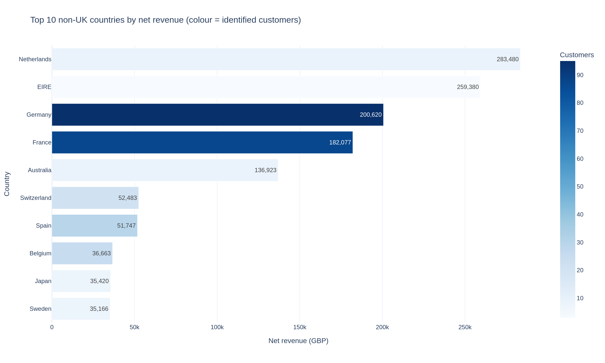](02_top10_non_uk_countries_net_revenue.md)

### Chart 03 — Top 10 Products by Net Revenue
[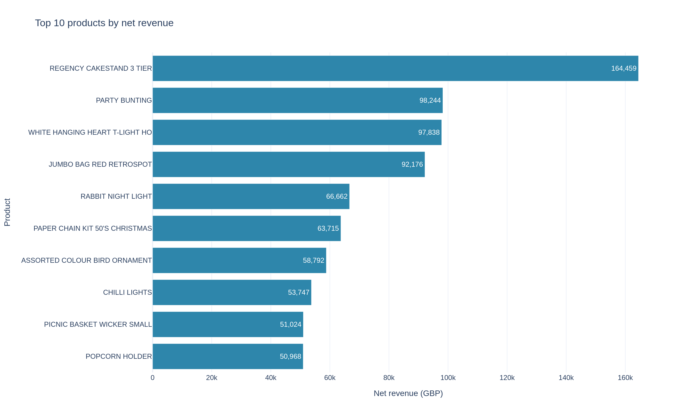](03_top10_products_net_revenue.md)

### Chart 04 — Cumulative Net Revenue Share by Product Rank (Pareto Curve)
[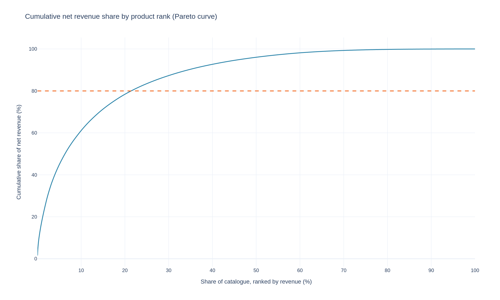](04_product_pareto_curve.md)

### Chart 05 — Net Revenue by Weekday and by Hour of Day
[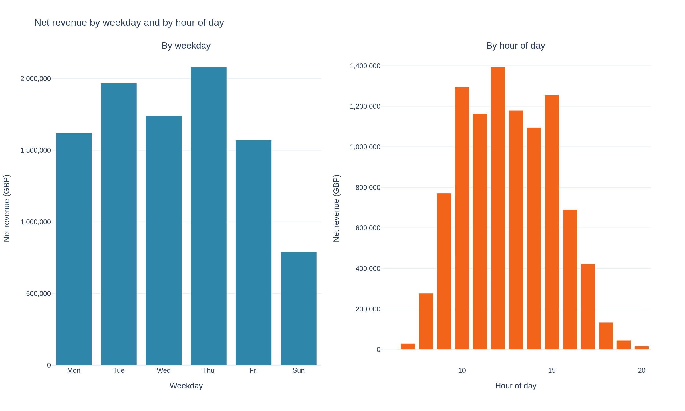](05_net_revenue_by_weekday_and_hour.md)

### Chart 06 — Monthly Return Rate by Value
[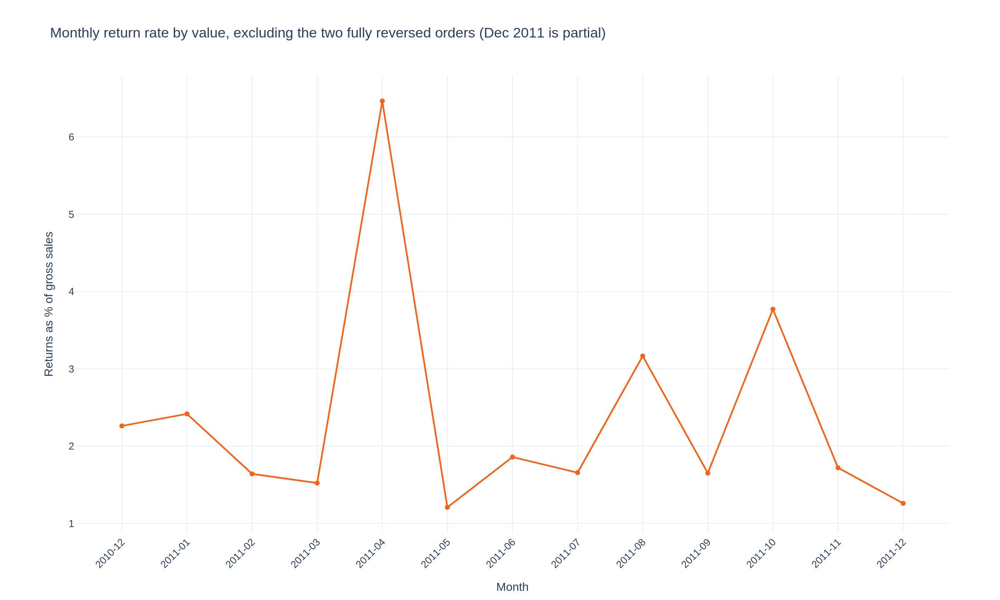](06_monthly_return_rate.md)

### Chart 07 — Cumulative Net Revenue Share by Customer Rank
[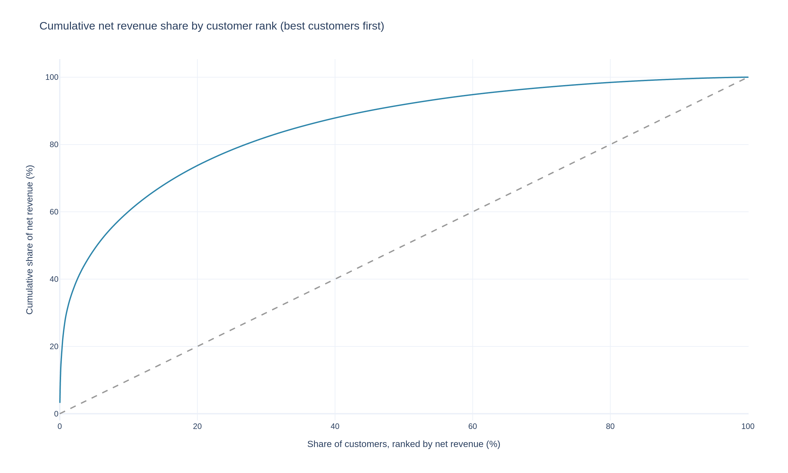](07_customer_revenue_concentration_curve.md)

### Chart 08 — Share of Customers vs Share of Net Revenue by Number of Orders
[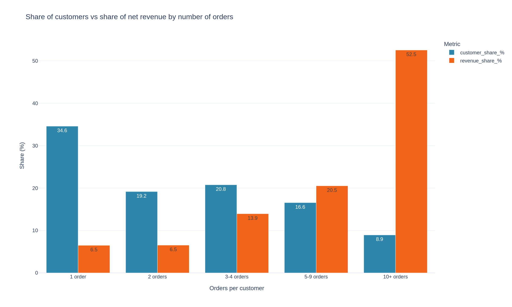](08_customer_vs_revenue_share_by_order_count.md)

### Chart 09 — RFM Segments: Recency vs Frequency
[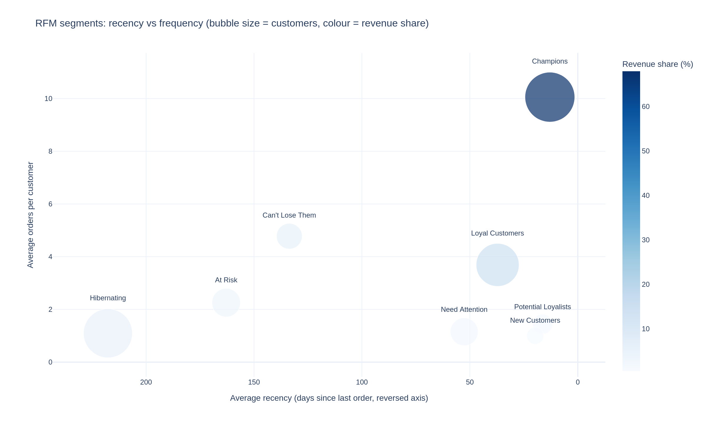](09_rfm_segments_bubble_chart.md)

### Chart 10 — Monthly Cohort Retention Heatmap
[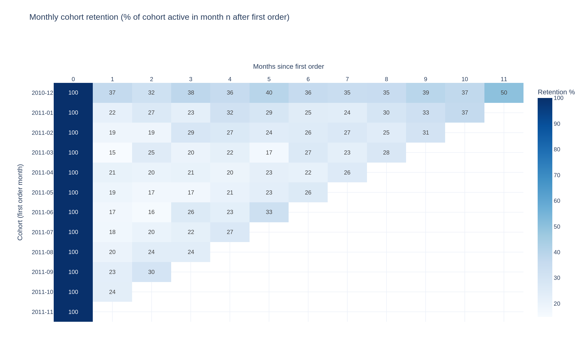](10_cohort_retention_heatmap.md)

### Chart 11 — Spearman Correlation Between Customer Metrics
[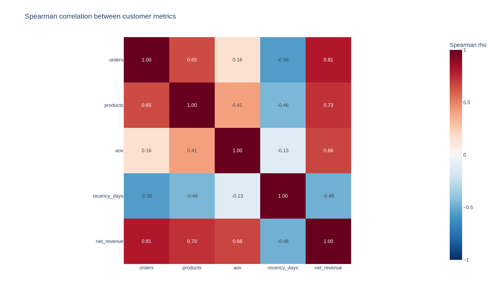](11_spearman_correlation_heatmap.md)

